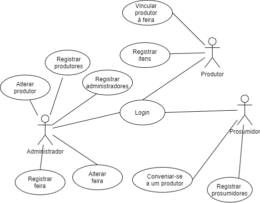

# Casos de uso

## CDU 1 - Login

**Fluxo principal**

1. O usuário clica no botão "Login" na página principal
2. O sistema deve oferecer os campos de Login
3. O usuário deve preencher os campos email e senha 
4. O usuário clica no botão "Login"
5. O sistema valida os dados do usuário
6. O sistema verifica se o usuário é um produtor, prosumidor ou administrador
7. O sistema redireciona o usuário à página principal

## CDU 2 - Registro de prosumidores

**Fluxo principal**

1. O usuário clica no botão "Registrar-se" na página principal
2. O sistema deve oferecer os campos de registro de um prosumidor
3. O usuário deve preencher os campos de nome completo, email e senha oferecidos pelo sistema
4. O usuário deve clicar no botão "Registrar-se"
5. O sistema valida os dados de registro e adiciona o prosumidor ao banco de dados
6. O sistema retorna ao usuário que a operação foi realizada
7. O sistema redireciona o usuário à página principal

## CDU 3 - Registro de produtores

**Fluxo principal**

1. O sistema deve oferecer os campos de registro de um produtor
2. O administrador deve preencher os campos nome completo, email, senha, endereço da propriedade e tamanho da propriedade
3. O administrador deve clicar no botão "Registrar produtor"
4. O sistema valida os dados de registro e adiciona a feira ao banco de dados
5. O sistema retorna ao administrador que a operação foi realizada
6. O sistema redireciona o administrador à página de gerenciamento

## CDU 4 - Registro de administradores

**Fluxo principal**

1. O sistema deve oferecer os campos de registro de um administrador
2. O administrador deve preencher os e nome completo, email e senha
3. O administrador deve clicar no botão "Registrar Administrador"
4. O sistema valida os dados de registro e adiciona o administrador ao banco de dados
5. O sistema retorna ao administrador que a operação foi realizada
6. O sistema redireciona o administrador à página de gerenciamento

## CDU 5- Registrar feira

**Fluxo principal**

1. O sistema deve oferecer os campos de registro de uma feira
2. O administrador deve preencher os campos dia da semana e endereço.
3. O administrador deve clicar no botão "Registrar Feira"
4. O sistema valida os dados de registro
5. O sistema retorna ao administrador que a operação foi realizada
6. O sistema redireciona o administrador à página de gerenciamento

## CDU 6 - Alterar produtor

**Fluxo principal**

1. O sistema deve oferecer uma tabela com o nome completo e e-mail de cada produtor, assim como uma opção "Editar" para cada produtor
2. O administrador deve clicar na opção "Editar" correspondente ao produtor que deseja alterar
3. O sistema deve oferecer um formulário com os dados do produtor
4. O administrador deve editar os dados e clicar no botão "Editar"
5. O sistema valida os dados do produtor
6. O sistema atualiza os dados do produtor no banco de dados
7. O sistema retorna ao administrador que a operação foi realizada
8. O sistema redireciona o administrador à página de gerenciamento

## CDU 7 - Alterar dados da feira

**Fluxo principal**

1. O sistema deve oferecer uma tabela com dia da semana e endereço, assim como uma opção "Editar" para cada feira
2. O administrador deve clicar na opção "Editar" correspondente à feira que deseja alterar
3. O sistema deve oferecer um formulário com os dados da feira
4. O administrador deve editar os dados e clicar no botão "Editar"
5. O sistema valida os dados da feira
6. O sistema atualiza os dados da feira no banco de dados
7. O sistema retorna ao administrador que a operação foi realizada
8. O sistema redireciona o administrador à página de gerenciamento

## CDU 8 - Registrar produtor em uma feira

**Fluxo principal**

1. Aos produtores o sistema disponibilizará os dados das feiras e a opção "Participar" na tela inicial
2. O produtor deve clicar na opção "Participar"
3. O sistema deve exibir uma tela de confirmação
4. O produtor deve clicar em "Confirmar"
5. O sistema atrela o produtor à feira no banco de dados
6. O produtor é redirecionado para a página de participação

## CDU 9 - Registrar itens

**Fluxo principal**

1. Aos produtores o sistema disponibilizará os dados das feiras em que estão participando e a opção "Registrar itens dessa semana" na página de participação
2. O produtor deve clicar na opção "Registrar itens dessa semana"
3. O sistema deve disponibilizar uma tabela com os dados dos itens registrados e a opção "Registrar item"
4. O produtor deve clicar na opção "Registrar item"
5. O sistema deverá disponibilizar um formulário de registro de itens
6. O produtor deve preencher os campos nome e descrição
7. O produtor deve clicar na opção "Registrar"
8. O sistema deve atrelar o item à feira em que o produtor esta participando
9. O sistema retorna ao produtor que a operação foi realizada
10. O produtor deve ser redirecionado para a página de participação

## CDU 10 - Conveiniar-se a um produtor

**Fluxo principal**

1. O prosumidor deve clicar na opção "Conveniar-se" na tela inicial
2. O prosumidor será redirecionado à página de compras
3. O prosumidor deve clicar na opção "Comprar" correspondente ao item que deseja
4. O prosumidor deve ser redirecionado para a página de pagamento
5. O sistema deve disponibilizar um formulário com as informações da compra
6. O prosumidor deve preencher o formulário com a quantidade de itens que deseja 
7. Dentre as formas de compra o prosumidor escolherá "Pagar agora"
8. O prosumidor deve preencher um formulário com os dados do cartão de crédito
9. O prosumidor deve clicar na opção "Comprar"
10. O sistema retorna ao prosumidor que a operação foi realizada
11. O sistema deve diminuir a quantidade de itens disponíveis na feira no banco de dados

# Diagrama de casos de uso

